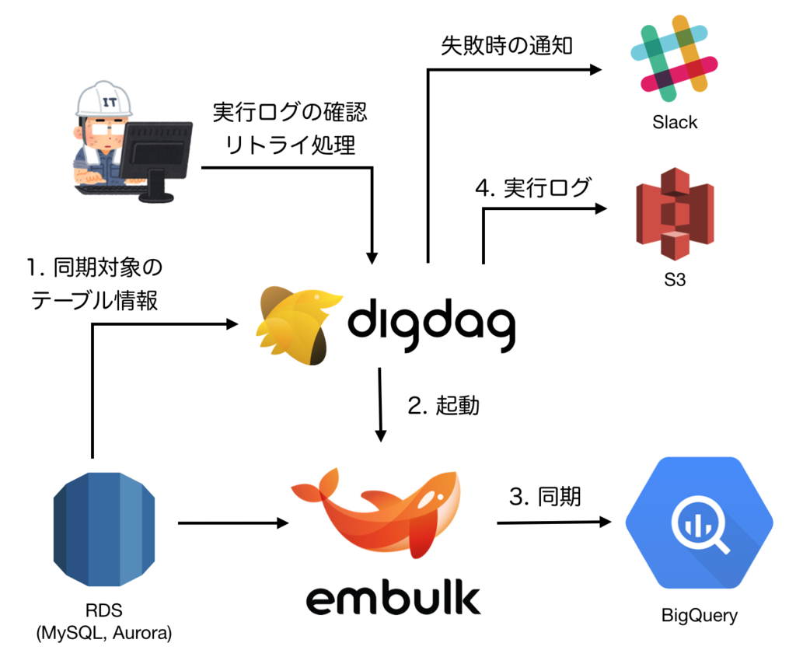
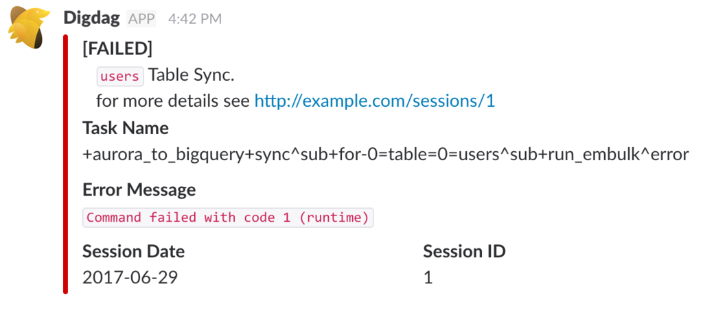
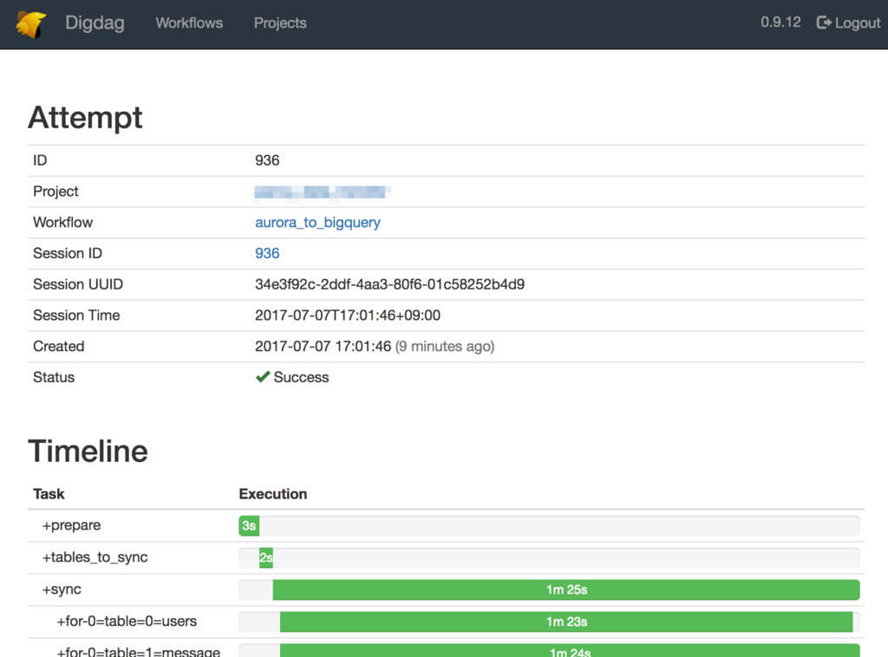
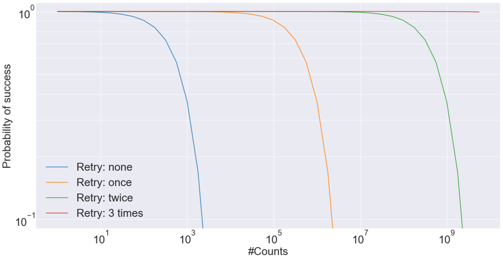
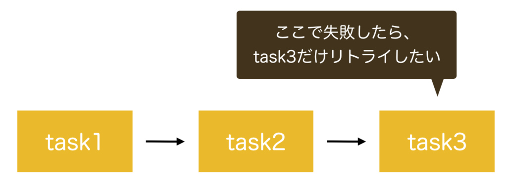
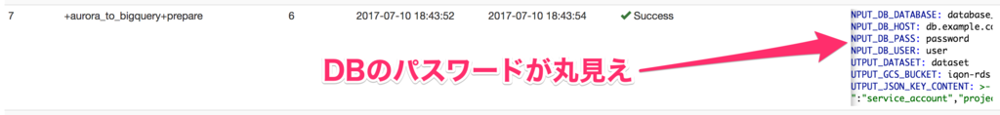
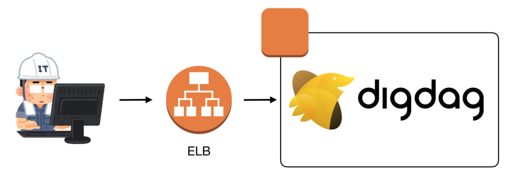
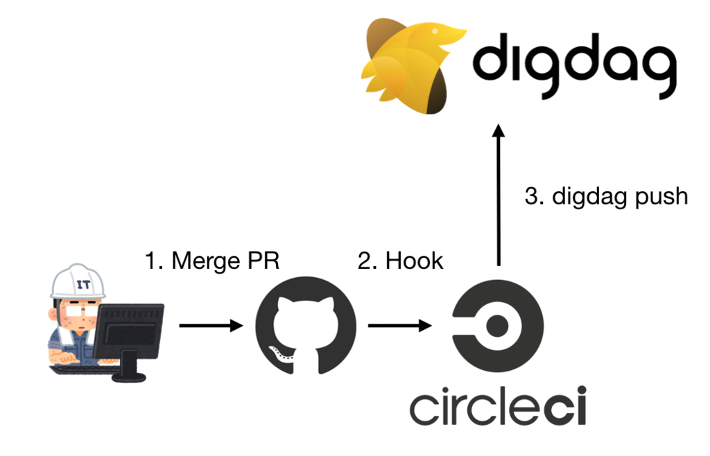

# Đồng bộ hóa dữ liệu chính RDS (Aurora, MySQL) với BigQuery bằng cách sử dụng Digdag và Embulk

Xin chào tất cả mọi người, vừa qua trong team mình có làm một project để chạy cập nhật dữ liệu và report cho máy chủ. Nó được viết dựa trên embulk và digdag là một server trạm và một thử viện để run batch job của ruby và một số ngôn ngữ khác. Mình vẫn đang trong giai đoạn tìm hiểu và đúc kết kinh nghiệm thông qua là nghiên cứu này.
...
<!--more-->
## 1. Embulk, Digdag là gì?

Đầu tiên mình sẽ giải thích về cách sử dụng Embulk và Digdag để xây dựng hệ thống. Cả hai đều là OSS by Treasure Data và đều có logo rất cute.

### 1.1 Embulk

**Embulk** hay còn được gọi là ETL tools với chức năng chủ yếu là trích xuất (Extract), chuyển đổi (Transfer) hay để đọc(Load) dữ liệu lớn. Với Embulk thì nó còn cung cấp nhiều plugins để làm việc với số lượng dữ liệu khổng lồ MYSQL, BigQuery. Do vậy mà tùy theo sự kết hợp với từng đối tượng cụ thể mà đầu vào và đầu ra của nó rất đa dạng.

### 1.2 Digdag

**Digdag** hay còn được gọi là Workflow engine, nó sẽ định nghĩa các workflow từ sự phụ thuộc của các tác vụ, thực thi và quản lý các quá trình đó. Nếu chỉ nói thế này bạn sẽ không thể nào hiểu được cụ thể nên mình sẽ cho một ví dụ sau đây.

Giả sử sau khi bạn xử lý tác vụ 1, thì sẽ xem xét các tác vụ 2,3,4 tiếp theo và tất cả phải được thực hiện trình tự mỗi ngày một lần tại lúc '00:00 p.m'. Và lúc này ta sẽ giải quyết vấn để này bằng cronjob.

```yaml
0 0 * * * job1
0 10 * * * job 2 # chạy sau job 1 10'
0 20 * * * job 3 # chạy sau job 2 10'
0 50 * * * job 4 # chạy sau job 3 30'
```

Tuy nhiên sẽ có nhiều vấn đề xoay quanh cron này.

* Vì một nguyên nhân nào đó mà thời gian thực thi của job1 nó lớn hơn 10', lúc đó thực thi job2 sẽ phải chờ job1?
* Việc thực thi của job1 thất bại thì các job 2, 3, 4 có bị hủy bỏ?

Bạn có thể giải quyết vấn đề trên bằng cách viết như thế này:

```yaml
0 0 * * * job1 && job2 && job3 && job4
```

Thế này thì được rồi nhỉ :). Nhưng nếu gặp một yêu cầu phức tạp như bên dưới này thì sao nhỉ?

* Mỗi job sẽ retry lại 3 lần nếu gặp lỗi
* Vì job 2, 3, 4 độc lâp với nhau nên sẽ thực hiện song song nhau.
* Thực thi một lúc 2 jobs song song nhau.

Nếu chỉ dùng config thông thường của cronjob thì thật là xin đầu hàng nhưng bằng digdag thì việc này khá là giản đơn.

``` yml
+ task1:
 sh>: job1

+parallel_tasks:
  _parallel: true
  + task2:
    _retry: 3
    sh>: job2
  + task3:
    _retry: 3
    sh>: job3
  + task4:
    _retry: 3
    sh>: job4
```

Cũng có nhiều Workflow engine tương tự như Jenkins, Aiflow, Luigi nhưng mà Digdag có vài lợi điểm hơn.

* Vì sử dụng `yaml` nên sẽ đỡ thời gian làm quen
* Cấu hình tính khả dụng cao (HA) dễ dàng
* Thao tác trên môi trường phân tán dễ dàng

### 1.3 Kết hợp Digdag và Embulk

Bằng cách kết hợp Digdag và Embulk, bạn có thể nhận được nhiều Embulk hơn nữa. Vì Embulk là một công cụ để thực hiện hiệu quả một quy trình ETL, nên nó không thể quản lý nhiều quy trình ETL.

Ví dụ: hãy xem xét chuyển nhiều bảng được lưu trữ trong Aurora sang BigQuery. Trong trường hợp này Embulk phải được gọi nhiều lần khi có bảng. Ngay cả khi có lỗi xảy ra trong quá trình chuyển, Embulk không thể thử lại hoặc thông báo cho bạn về lỗi đó. Ngoài ra, Embulk không hỗ trợ xử lý tùy ý trước hoặc sau khi đồng bộ hóa bảng.

Bằng cách sử dụng Digdag, bạn sẽ dễ dàng quản lý hiệu quả nhiều lệnh gọi Embulk và xử lý chèn trước và sau ETL.

## 2. Tổng quan hệ thống


Trước hết mình sẽ giải thích từ 1->4. Bây giờ mỗi ngày job sẽ được thực thi 1 lần và theo Digdag sẽ cấu hình như bên dưới.

### 2.1 Thu thập thông tin bảng của đối tượng đồng thời

Nhận thông tin bảng để đồng bộ hóa từ Aurora. Theo mặc định, nó sẽ đồng bộ hóa tất cả các bảng tồn tại trong Aurora.

### 2.2 Khởi động Embulk

Digdag gọi đến Embulk. Xử lý đồng bộ nhiều bảng là độc lập với nhau, vì vậy để tăng tốc độ xử lý, nhiều tiến trình của Embulk được khởi động và xử lý song song được thực hiện.
đến

### 2.3 Đồng bộ hóa từ Aurora sang BigQuery

Embulk xử lý quá trình đồng bộ hóa từ Aurora sang BigQuery. Digdag chuyển thông tin cần thiết để kết nối với Aurora và BigQuery. Thông tin được truyền từ Digdag được mở rộng bởi Liquid, công cụ cám dỗ được tích hợp sẵn của Embulk.

### 2.4 Lưu log thực thi

Log của mỗi quy trình từ 1 đến 3 được tải lên S3. Logs bao gồm thời gian bắt đầu tác vụ, thời gian kết thúc, nội dung xuất ra đầu ra tiêu chuẩn, v.v.
jobs
Ngoài ra, nếu jobs không thành công, Slack sẽ được thông báo (phía trên bên phải).


Ngoài ra, bạn cNotificationra logs và thử lại các tác vụ không thành công từ giao diện người dùng web (Digdag UI) được tích hợp trong Digdag (phía trên bên trái của hình trên).


## 3. Trích xuất bằng DigdUI

So với việc tiếp tục sử dụng trình bao bọc go trong khi mở rộng nó, việc sử dụng Digdag giúp giải quyết các vấn đề sau dễ dàng hơn.

### 3.1 Xử lý retry

Ngay cả khi xác suất thành công của mỗi job là đủ cao, nhưng nếu bạn thực hiện job liên tiếp, xác suất thành công của tất cả các job là thấp. Ví dụ: nếu bạn thực hiện 1.000 jobs liên tiếp với 99,9% cơ hội thành công, thì chỉ có 36,8% cơ hội là tất cả chúng sẽ thành công. Nếu bạn làm điều đó 10.000 lần liên tiếp, nó sẽ chỉ là 0,0045%. Tuy nhiên, chỉ với một quy trình thử lại không thành công, các xác suất này lần lượt là 99,9% và 99,0%. Trên thực tế, các tác vụ truy cập mạng như tác vụ này (Aurora, BigQuery, v.v.) có thể hết thời gian chờ do trục trặc mạng. Thử xử lý lại là điều cần thiết vì kết quả là việc thực thi tác vụ có thể không thành công.

Biểu đồ bên dưới thể hiện mối quan hệ giữa xác suất thành công trong tất cả các job (trục tung) và số nhiệm vụ liên tiếp (trục hoành) (lưu ý: trục tung và trục hoành là logarit). Nếu bạn cho phép tối đa 3 lần thử lại, tất cả các tác vụ sẽ thành công với xác suất là 99,9% ngay cả khi chúng được thực hiện 109 (1 tỷ) lần liên tiếp.



Như bạn có thể thấy, quá trình thử lại rất hiệu quả, nhưng nó cũng là một quá trình thường bị lãng quên vì khó thực hiện và kiểm tra. Với Digdag, quá trình thử lại có thể được thực hiện đơn giản bằng cách viết một dòng cài đặt trong định nghĩa tác vụ, do đó có thể dễ dàng giới thiệu quá trình thử lại.

```yml
_retry: 3

+ task1:
  sh>: sometimes_fail.sh
+ task2:
  sh>: sometimes_fail.sh
+ task3:
  sh>: sometimes_fail.sh
```

Ngoài ra, nếu một job sau này trong dòng công việc không thành công, thì việc bắt đầu lại dòng công việc từ đầu là vô ích. Đặc biệt là khi thời gian xử lý các tác vụ trong nửa đầu của quy trình làm việc kéo dài, thì sự lãng phí là điều dễ nhận thấy. Do đó, tôi chỉ muốn thử lại các tác vụ không thành công.


Digdag giải quyết vấn đề này bằng cách đặt thử lại cho mỗi tác vụ.

```yml
+task1:
  _retry: 3
  sh>: sometimes_fail.sh
+task2:
  _retry: 3
  sh>: sometimes_fail.sh
+task3:
  _retry: 3
  sh>: sometimes_fail.sh
```

### 3.2 Xử lý song song

Bằng cách chạy song song các tác vụ độc lập, bạn có thể rút ngắn thời gian thực hiện của toàn bộ quy trình làm việc. Ngoài ra, nếu các loại tài nguyên máy (CPU, bộ nhớ, mạng, v.v.) được sử dụng bởi mỗi tác vụ là khác nhau, thì tài nguyên máy có thể được sử dụng một cách hiệu quả.

Tuy nhiên, việc viết các chương trình xử lý song song không có lỗi là rất khó và chúng tôi thường phải vật lộn với các lỗi không thể lặp lại. Với Digdag, Digdag đảm nhận phần việc nặng nhọc của tính song song này, cho phép người dùng Digdag tập trung vào các nhiệm vụ cá nhân của họ. Ngoài ra, bạn có thể dễ dàng điều chỉnh số lần thực thi song song với các tùy chọn khởi động Digdag.

### 3.3 Cấu hình HA

Một trong những vấn đề khi sử dụng cron để quản lý quy trình làm việc là điều gì sẽ xảy ra nếu máy chủ ngừng hoạt động. Máy chủ cron không phải là máy chủ không trạng thái và không thể dễ dàng mở rộng quy mô.

Digdag giải quyết vấn đề này bằng cách lưu trữ chính quy trình làm việc và trạng thái của nó trong PostgreSQL. Các công nhân thực thi các tác vụ và Giao diện người dùng Digdag đều không có trạng thái, vì vậy chúng có thể dễ dàng thu nhỏ và định cấu hình cho HA.

Tất nhiên, khi đặt Digdag thành cấu hình HA, bản thân PostgreSQL cũng cần được đặt thành cấu hình HA, chẳng hạn như đặt RDS thành cấu hình Multi-AZ.

### 3.4 Kiểm tra nhật ký thực thi tác vụ trong Digdag UI

Máy chủ Digdag đi kèm với giao diện người dùng web (Digdag UI), mà bạn có thể sử dụng để thực hiện những việc như:

* Kiểm tra Nhật ký thực thi quy trình công việc
* Thử lại quy trình làm việc không thành công
* Chạy quy trình làm việc ngay

Vì các thao tác này có thể được thực hiện từ Giao diện người dùng Digdag nên ngay cả những thành viên không quen thuộc với các lệnh Digdag cũng có thể thực hiện các thao tác.

Tài liệu không đề cập đến cách khởi chạy giao diện người dùng Digdag, nhưng nó thực sự khởi chạy khi bạn khởi động máy chủ Digdag. Theo mặc định, nó xuất hiện trên cổng 65432, vì vậy bạn có thể xem Giao diện người dùng Digdag bằng cách truy cập <http://localhost:65432/>. Lưu ý rằng Node.js 7.x được viết trong Yêu cầu README của GitHub, nhưng Node.js không bắt buộc trừ khi phát triển Giao diện người dùng Digdag.

## 4. File config

Sau đó, từ đây, tôi sẽ giải thích bằng một tệp cấu hình cụ thể.

### 4.1 Digdag

#### `aurora_to_bigquery.dig`

```yml
timezone: Asia/Tokyo

# Slack通知のためのプラグインの読み込み
_export:
  plugin:
    repositories:
      - https://jitpack.io
    dependencies:
      - com.github.szyn:digdag-slack:0.1.1
  webhook_url: https://hooks.slack.com/services/HOGE
  workflow_name: aurora_to_bigquery

# 認証情報の取得
+get_db_info:
  _retry: 3
  _export:
    docker:
      image: ruby:2.4.1
      build:
        - gem install aws-sdk
  rb>: Prepare.get_db_info
  require: 'tasks/prepare'

# 同期対象テーブルの取得
+get_tables_to_sync:
  _retry: 3
  _export:
    docker:
      image: ruby:2.4.1
      build:
        - gem install mysql2
  rb>: Prepare.get_tables_to_sync
  require: 'tasks/prepare'

# 同期処理
+sync:
  for_each>:
    table: ${TABLES}
  _parallel: true
  _do:
    call>: sync_one_table.dig
```

Quy trình làm việc này được chia thành ba phần chính. Mỗi nhiệm vụ là ba nhiệm vụ: get_db_info, get_tables_to_sync, đồng bộ hóa.

Get_db_info đầu tiên nhận mật khẩu để kết nối với Aurora và khóa JSON để kết nối với Google Cloud Platform (GCP). Chúng được lưu trữ trong Hệ thống quản lý khóa Amazon (KMS), vì vậy chúng được phiên bản Ruby của aws-sdk truy xuất và đặt làm biến Digdag.

Get_tables_to_sync thứ hai nhận danh sách các bảng sẽ được đồng bộ hóa. Dưới mui xe, nó thực hiện `SHOW TABLES` để lấy danh sách các bảng.

Và quá trình đồng bộ hóa cuối cùng là nội dung của quá trình đồng bộ hóa, gọi nội bộ Embulk. Đồng bộ hóa nhiều bảng bằng cách sử dụng các biến được đặt bởi hai tác vụ ngược dòng. Toán tử `call` được sử dụng để thực thi Embulk trong khi thay đổi tham số cho từng bảng. Ngoài ra, quá trình xử lý song song được thực hiện vì `_parallel: true` được đặt. Số lượng thực thi song song đồng thời được kiểm soát bởi tùy chọn `--max-task-threads` khi khởi động máy chủ Digdag. Do đó, tất cả các bảng không được đồng bộ hóa cùng một lúc và nhóm luồng được sử dụng một cách thích hợp.

Docker được sử dụng để cách ly môi trường mà các tác vụ này được thực thi. Điều này giúp loại bỏ nhu cầu cài đặt Ruby, đá quý, v.v. trên chính máy chủ mà Digdag đang chạy, giảm thời gian và công sức cần thiết để xây dựng máy chủ. Vì việc tự quản lý Dockerfiles và Docker image rất phức tạp nên chúng tôi sử dụng Docker image chính thức được lưu trữ trong DockerHub. Và tôi đang cài đặt các thư viện cần thiết, v.v. trên những hình ảnh đó. Do đó, lần đầu tiên bạn chạy nó, bạn sẽ phải đợi một lúc để cài đặt gem. Tuy nhiên, từ lần thứ hai trở đi, hình ảnh Docker được xây dựng sẽ được sử dụng, vì vậy vùng chứa sẽ khởi động nhanh chóng.

#### `sync_one_table.dig`

```yml
+get_timestamp_columns:
  _retry: 3
  _export:
   docker:
      image: ruby:2.4.1
      build:
        - gem install mysql2
  rb>: ColumnOption.get_timestamp_columns
  require: 'tasks/column_option'

+get_columns_to_drop:
  _export:
    docker:
      image: ruby:2.4.1
  rb>: ColumnOption.get_columns_to_drop
  require: 'tasks/column_option'

+run_embulk:
  _retry: 1
  _export:
    EMBULK_INPUT_TABLE: ${table}
    EMBULK_OUTPUT_TABLE: ${table}
    docker:
      image: java:7-jre
      build:
        - curl --create-dirs -o /bin/embulk -L https://dl.bintray.com/embulk/maven/embulk-0.8.25.jar
        - chmod +x /bin/embulk
  sh>: embulk gem install embulk-input-mysql embulk-filter-column embulk-output-bigquery && embulk run aurora_to_bigquery.yml.liquid
  _error:
    slack>: failed-to-sync-table-template.yml
```

Quy trình con này truy xuất các cài đặt trên mỗi bảng và khởi chạy Embulk dựa trên chúng. Quy trình công việc này được gọi bởi toán tử cuộc gọi từ aurora_to_bigquery đã đề cập ở trên.

Quy trình công việc này bao gồm `get_timestamp_columns`, `get_columns_to_drop` và `run_embulk`. Hai tác vụ đầu tiên đặt các biến môi trường cụ thể cho từng bảng và tác vụ cuối cùng run_embulk bắt đầu Embulk.
`get_timestamp_columns` đặt tên cột loại `DATETIME` thành biến môi trường. Nếu bạn đồng bộ hóa với mặc định, cột loại `DATETIME` trong Aurora sẽ là loại DẤU THỜI GIAN trong BigQuery. Thoạt nhìn, có vẻ như không có vấn đề gì vì loại ngày trong Aurora cũng là loại ngày trong BigQuery. Tuy nhiên, khi tôi kiểm tra kết quả thực hiện truy vấn trên giao diện người dùng web của BigQuery, kết quả này không được hiển thị ở UTC và việc thay đổi thời gian theo 9 giờ trong đầu tôi hơi phức tạp. Do đó, bằng cách lưu ở loại CHUỖI ở định dạng `%Y-%m-%d %H:%M:%S%:z`, nó cân bằng khả năng đọc và tính dễ tính ngày. Định dạng này thường được hiển thị trong JST nên con người dễ dàng kiểm tra, đồng thời dễ dàng chuyển đổi sang kiểu DẤU THỜI GIAN nên dễ dàng thực hiện các phép tính ngày tháng. Nhân tiện, trong nội bộ, SQL sau đây được phát hành để đọc thông tin lược đồ của bảng.

```sql
SELECT COLUMN_NAME, COLUMN_TYPE
FROM INFORMATION_SCHEMA.COLUMNS
WHERE TABLE_SCHEMA = (SELECT database()) AND TABLE_NAME = '#{table_name}'
```

`get_columns_to_drop` đặt các cột không được đồng bộ hóa thành các biến môi trường. Vì dữ liệu do hệ thống này xử lý bao gồm dữ liệu nhạy cảm nên các cột đó bị loại trừ khỏi mục tiêu đồng bộ hóa. YAML kiểm soát những cột nào bị loại trừ. Tôi đã sử dụng plugin `embulk-filter-column` cho quy trình này.

Embulk được gọi bởi tác vụ `run_embulk` cuối cùng. Sau khi cài đặt Embulk gem cần thiết để đồng bộ hóa, hãy bắt đầu Embulk để đồng bộ hóa các bảng. Nếu xảy ra lỗi trong quá trình này, Slack sẽ được thông báo.

Thông tin chi tiết về tệp `aurora_to_bigquery.yml.liquid` được chuyển làm đối số cho Embulk được mô tả trong phần tiếp theo.

### 4.2 Embulk

#### `aurora_to_bigquery.yml.liquid`

```yml
in:
  type: mysql
  host: {{ env.EMBULK_INPUT_DB_HOST }}
  user: {{ env.EMBULK_INPUT_DB_USER }}
  password: {{ env.EMBULK_INPUT_DB_PASS }}
  database: {{ env.EMBULK_INPUT_DB_DATABASE }}
  table: {{ env.EMBULK_INPUT_TABLE }}


filters:
  - type: column
    drop_columns:
    
    
      - { name: {{column}} }
    


out:
  type: bigquery
  mode: replace
  auth_method: json_key
  json_keyfile:
    content: |
        {{ env.EMBULK_OUTPUT_JSON_KEY_CONTENT }}
  project: {{ env.EMBULK_OUTPUT_PROJECT }}
  dataset: {{ env.EMBULK_OUTPUT_DATASET }}
  table: {{ env.EMBULK_OUTPUT_TABLE }}
  open_timeout_sec: 300
  send_timeout_sec: 300
  read_timeout_sec: 300
  retries: 5
  gcs_bucket: {{ env.EMBULK_OUTPUT_GCS_BUCKET }}
  auto_create_gcs_bucket: false
  compression: GZIP
  source_format: NEWLINE_DELIMITED_JSON
  default_timezone: "Asia/Tokyo"
  column_options:
  
  
    - { name: {{ column }}, type: STRING, timestamp_format: "%Y-%m-%d %H:%M:%S%:z" }
  
```

Tệp này là tệp cấu hình được chuyển đến Embulk. Chúng tôi sử dụng Liquid, công cụ mẫu được tích hợp trong Embulk. Các biến của Digdag được đặt trong môi trường khi bạn chạy các lệnh bằng toán tử sh. Vì vậy, trong Embulk, bạn có thể đọc nó với ký hiệu env..

Biến môi trường chỉ lưu trữ được thông tin kiểu vô hướng nên khi bạn muốn lưu trữ dưới dạng mảng thì hãy lưu trữ ở định dạng được phân cách bằng dấu phẩy và chia nhỏ.

Ngoài ra, các biến môi trường sau đây được lưu trữ trong KMS và Embulk được bắt đầu với chúng do tác vụ `get_db_info` ngược dòng thiết lập.

* EMBULK_INPUT_DB_PASS
* EMBULK_OUTPUT_JSON_KEY_CONTENT

Tôi nghĩ đó sẽ là một ý tưởng hay vì tôi không còn phải nhúng trực tiếp thông tin đăng nhập vào YAML hoặc mã nguồn nữa, nhưng giao diện người dùng web sẽ hiển thị thông tin đăng nhập. Do đó, một số biện pháp đối phó vẫn là công việc trong tương lai. Bằng cách sử dụng chức năng bí mật, thông tin xác thực sẽ không còn trong nhật ký ở dạng văn bản thuần túy, vì vậy chúng tôi đang cân nhắc sử dụng chức năng này.



## 5. Cấu tạo server Digdag

### 5.1 Chạy nền(demon)

Máy chủ Digdag được daemoềnhóa bằng systemd. Tôi đã sử dụng ý chính sau đây làm tài liệu tham khảo cho các tệp cần thiết cho quá trình nền.

<https://gist.github.com/uu59/23968e3983adcf5b4cce400710b51cb2>

H2DB được sử dụng cho DB quản lý trạng thái của quy trình công việc và tác vụ, đồng thời các tệp DB được đặt trong thư mục cục bộ của máy chủ Digdag. Vì chúng tôi chỉ có một máy chủ Digdag trong cấu hình của mình, chúng tôi sẽ kích hoạt cả tác nhân cục bộ(local-agent) và vòng lặp thực thi(executor-loop).

Mã nguồn quy trình làm việc và nhật ký thực hiện tác vụ được lưu trong S3. Thông tin xác thực để truy cập S3 không được ghi trong tệp cấu hình để sử dụng cấu hình phiên bản IAM.

`/etc/systemd/system/digdag.service`

``` yml
[Unit]
Description=digdag

[Service]
User=root
Restart=always
TimeoutStartSec=30s
Type=simple
ExecStart=/etc/init.d/digdag.sh

[Install]
WantedBy=multi-user.target
```

`/etc/init.d/digdag.sh`

```sh
#!/usr/bin/env bash

set -ue

exec >> /var/log/digdag.log
exec 2>> /var/log/digdag-error.log

exec /usr/local/bin/digdag server --database /var/digdag/database --access-log /var/digdag/log/access_log --config /etc/digdag/config.properties
```

`/etc/digdag/config.properties`

```sh
server.bind=127.0.0.1
server.port=65432
database.type=h2

archive.type=s3
archive.s3.bucket=<s3 bucket name>
archive.s3.path=digdag/archive

log-server.type=s3
log-server.s3.bucket=<s3 bucket name>
log-server.s3.path=digdag/log
```

### 5.2 Digdag UI

Chúng tôi đã sử dụng Cân bằng tải đàn hồi (ELB) để truy cập giao diện người dùng Digdag từ bên ngoài VPC. Trong trường hợp này, chúng tôi chỉ có một máy chủ Digdag, vì vậy chúng tôi không sử dụng ELB để cân bằng tải. Tuy nhiên, xét rằng Digdag giúp dễ dàng xây dựng cấu hình HA, chúng tôi đã gắn Digdag dưới ELB khi chuyển sang cấu hình HA.

Bạn cũng có thể truy cập Giao diện người dùng Digdag để thực hiện hầu hết mọi thứ liên quan đến quy trình làm việc của mình. Vì vậy, chúng tôi cần hạn chế những người có thể truy cập Giao diện người dùng Digdag. Hiện tại, ELB hạn chế quyền truy cập bằng cách xem địa chỉ IP của nguồn kết nối.



### Deploy

Triển khai quy trình làm việc từ CircleCI. Kết nối hợp nhất với nhánh chính trên GitHub và đưa ra lệnh đẩy digdag từ vùng chứa trên CircleCI.



### Tổng kết

Bằng cách sử dụng Digdag và Embulk cùng nhau, chúng tôi đã thành công trong việc xây dựng một hệ thống đồng bộ hóa dữ liệu chính được lưu trữ trong Aurora với BigQuery. Có một số phần khó sử dụng chỉ với Embulk, nhưng Digdag đã bù đắp cho những phần đó và có thể cải thiện tính hoàn thiện của hệ thống. Đặc biệt, chức năng xử lý thử lại, chức năng thực thi song song và chức năng xác nhận nhật ký thực thi bằng giao diện người dùng web rất khó viết một mình, vì vậy Digdag rất hữu ích trong việc xử lý những điều này.
Có rất ít tài liệu về Digdag nên khi gặp sự cố, bạn có thể không tìm thấy bất kỳ thông tin nào ngay cả khi tìm kiếm trên Stack Overflow hoặc Qiita. Do đó, tôi thường đọc mã nguồn Digdag để giải quyết vấn đề. VASILY đang tìm kiếm những người muốn tích cực giới thiệu các công nghệ mới trong khi chấp nhận thách thức của những khó khăn này. Nếu bạn quan tâm, vui lòng đăng ký từ biểu ngữ bên dưới.

### Nguồn tham khảo

<https://techblog.zozo.com/entry/digdag_and_embulk>

